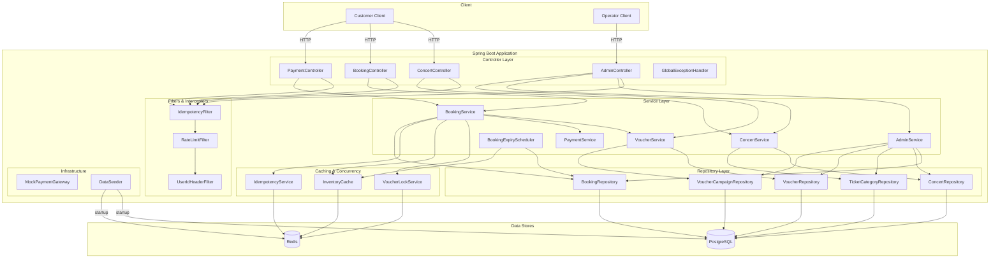
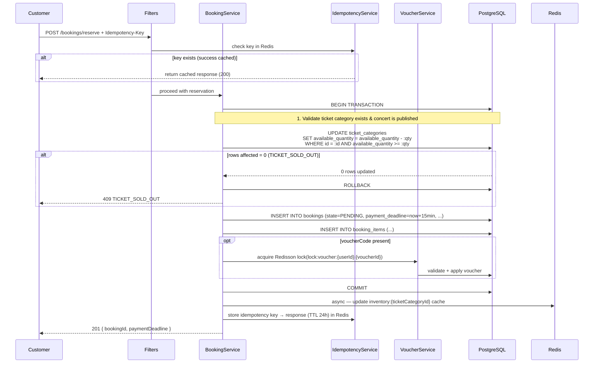
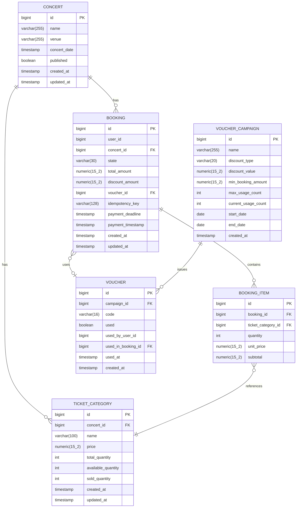
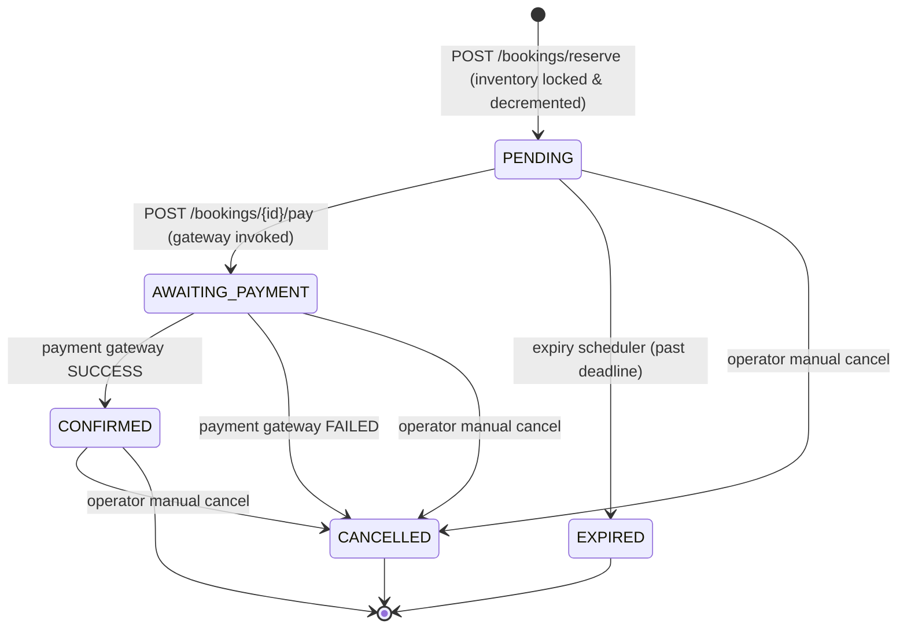

# Design Document

## Concert Ticket Booking Platform

---

## Overview

The Concert Ticket Booking Platform is a monolithic Spring Boot 3 backend service that supports two user classes — **Customers** and **Operators** — and is designed to handle flash-sale concurrency of up to 50,000 simultaneous users at 300–500 booking requests/minute without overselling.

The system exposes a RESTful JSON API under `/api/v1`, wraps all responses in a standard envelope, and enforces correctness guarantees through distributed locking (Redisson), Redis-backed inventory caching, idempotency deduplication, and a well-defined booking state machine.

**Key design decisions:**

| Concern | Decision | Rationale |
|---|---|---|
| Inventory concurrency | Atomic `UPDATE … WHERE available_quantity >= qty` in DB transaction | Database row-level CAS eliminates overselling without a distributed lock per category; correct under multi-instance deployment |
| Inventory source of truth | **PostgreSQL** (write path); Redis cache for reads only | DB transaction is the single authoritative decrement; Redis serves fast availability reads during browsing |
| Duplicate booking prevention | Redis-based idempotency key (24h TTL) | Stateless, fast, horizontally scalable |
| Booking expiry | Scheduled Spring `@Scheduled` job | Decoupled from request path; simple and observable |
| Authentication | `X-User-Id` header mock | Keeps focus on booking correctness and concurrency logic |
| Payment | Mocked gateway | Returns configurable SUCCESS/FAILED responses |
| Rate limiting | In-process `RateLimiter` via Redis sliding window | Per-user, 200 req/min, returns 429 with `Retry-After` |
| Voucher race prevention | Redisson `RLock` scoped to `userId + voucherId` | Prevents the same user from concurrently double-applying a voucher; narrow scope avoids contention |

---

## Architecture

### System Architecture Diagram



### Request Flow: Flash Sale Reservation



---

## Components and Interfaces

### Controller Layer

| Controller | Endpoints | Responsibility |
|---|---|---|
| `ConcertController` | `GET /api/v1/concerts`, `GET /api/v1/concerts/{id}` | Browse published concerts |
| `BookingController` | `POST /api/v1/bookings/reserve`, `GET /api/v1/bookings`, `GET /api/v1/bookings/{id}` | Customer booking management |
| `PaymentController` | `POST /api/v1/bookings/{id}/pay` | Payment submission |
| `AdminBookingController` | `GET /api/v1/admin/bookings`, `PATCH /api/v1/admin/bookings/{id}/state` | Operator booking management |
| `AdminConcertController` | `POST /api/v1/admin/concerts`, `POST /api/v1/admin/concerts/{id}/publish`, `GET /api/v1/admin/concerts/{id}/inventory`, `PATCH /api/v1/admin/ticket-categories/{id}/quantity` | Concert & inventory management |
| `AdminVoucherController` | `POST /api/v1/admin/voucher-campaigns`, `POST /api/v1/admin/voucher-campaigns/{id}/vouchers`, `GET /api/v1/admin/voucher-campaigns/{id}/stats` | Voucher campaign management |

All controllers annotate request DTOs with `@Valid` and return `ApiResponse<T>`.

### Service Layer

| Service | Key Responsibilities |
|---|---|
| `BookingService` | Reservation flow (atomic DB decrement → persist booking → async Redis cache update), payment processing, booking state transitions |
| `ConcertService` | Concert browsing, inventory reads (Redis-first), concert creation/publish |
| `VoucherService` | Voucher validation, discount calculation, usage tracking, Redisson lock per userId+voucherId |
| `PaymentService` | Delegates to `MockPaymentGateway`, handles timeout |
| `AdminService` | Operator-level state transitions, admin queries with filtering |
| `BookingExpiryScheduler` | `@Scheduled` job (every 30s), finds PENDING bookings past deadline, expires them, restores DB quantity and Redis cache |

### Cross-Cutting Components

| Component | Implementation | Purpose |
|---|---|---|
| `IdempotencyFilter` | `OncePerRequestFilter` | Check/store idempotency keys in Redis |
| `RateLimitFilter` | Redis sliding window counter | 200 req/min per `X-User-Id`, returns 429 |
| `GlobalExceptionHandler` | `@ControllerAdvice` | Maps all exceptions to standard `ApiResponse` error envelopes |
| `ApiResponse<T>` | Generic wrapper | `{ success, data/error, timestamp }` |
| `DataSeeder` | `CommandLineRunner` | Idempotent demo data loading on startup |
| `VoucherLockService` | Redisson `RLock` | Serializes concurrent voucher applications scoped to `userId + voucherId` |

### API Response Envelope

```java
// Success
{
  "success": true,
  "data": { /* payload */ },
  "timestamp": "2024-01-15T10:30:00.000Z"
}

// Error
{
  "success": false,
  "error": {
    "code": "TICKET_SOLD_OUT",
    "message": "The requested ticket category has no remaining inventory."
  },
  "timestamp": "2024-01-15T10:30:00.000Z"
}

// Validation Error (HTTP 400)
{
  "success": false,
  "error": {
    "code": "VALIDATION_ERROR",
    "message": "Request validation failed.",
    "fields": [
      { "field": "quantity", "reason": "must be between 1 and 10" }
    ]
  },
  "timestamp": "2024-01-15T10:30:00.000Z"
}
```

### Key API Endpoint Designs

**POST /api/v1/bookings/reserve**

Request:
```json
{
  "concertId": 1,
  "items": [
    { "ticketCategoryId": 2, "quantity": 3 }
  ],
  "voucherCode": "PROMO2024"
}
```
Headers: `Idempotency-Key: <uuid>`, `X-User-Id: <userId>`

Response (201):
```json
{
  "success": true,
  "data": {
    "bookingId": 42,
    "state": "PENDING",
    "totalAmount": 1500000,
    "paymentDeadline": "2024-01-15T10:45:00.000Z"
  },
  "timestamp": "2024-01-15T10:30:00.000Z"
}
```

**POST /api/v1/bookings/{id}/pay**

Request: `{ "paymentMethod": "MOCK" }`

Response (200 on success):
```json
{
  "success": true,
  "data": {
    "bookingId": 42,
    "state": "CONFIRMED",
    "items": [{ "ticketCategoryName": "VIP", "quantity": 3, "unitPrice": 500000 }],
    "voucherCode": "PROMO2024",
    "totalAmount": 1350000,
    "paymentTimestamp": "2024-01-15T10:31:00.000Z"
  },
  "timestamp": "2024-01-15T10:31:00.000Z"
}
```

---

## Data Models

### Entity Relationship Diagram



### Redis Key Patterns

| Key Pattern | Type | TTL | Purpose |
|---|---|---|---|
| `inventory:{ticketCategoryId}` | String (integer) | None (invalidated after DB commit) | **Read cache** for concert browsing — not the write source of truth; updated asynchronously after successful DB transaction |
| `idempotency:{key}` | String (JSON) | 24 hours | Cached response for duplicate-request prevention |
| `lock:voucher:{userId}:{voucherId}` | Redisson RLock | 10s lease | Prevents concurrent voucher double-application by the same user |
| `rate:{userId}` | String (counter) | 60 seconds sliding | Per-user rate limiter counter |

### Booking State Machine



**Valid state transitions table:**

| From | To | Trigger | Side Effects |
|---|---|---|---|
| `PENDING` | `AWAITING_PAYMENT` | Customer pays | None |
| `AWAITING_PAYMENT` | `CONFIRMED` | Gateway SUCCESS | Record `payment_timestamp`, final amount |
| `AWAITING_PAYMENT` | `CANCELLED` | Gateway FAILED | Restore DB inventory (UPDATE available_quantity + qty); update Redis cache; restore voucher usage |
| `PENDING` | `EXPIRED` | Expiry scheduler | Restore DB inventory (UPDATE available_quantity + qty); update Redis cache; restore voucher usage |
| `PENDING` | `CANCELLED` | Operator action | Restore DB inventory (UPDATE available_quantity + qty); update Redis cache; restore voucher usage |
| `CONFIRMED` | `CANCELLED` | Operator action | Restore DB inventory (UPDATE available_quantity + qty); update Redis cache; restore voucher usage |
| `AWAITING_PAYMENT` | `CANCELLED` | Operator action | Restore DB inventory (UPDATE available_quantity + qty); update Redis cache; restore voucher usage |

### JPA Entities (key fields)

```java
@Entity @Table(name = "bookings")
public class Booking {
    @Id @GeneratedValue Long id;
    Long userId;
    @ManyToOne Concert concert;
    @Enumerated(EnumType.STRING) BookingState state;
    BigDecimal totalAmount;
    BigDecimal discountAmount;
    @ManyToOne Voucher voucher;
    @Column(unique = true) String idempotencyKey;
    LocalDateTime paymentDeadline;
    LocalDateTime paymentTimestamp;
    @OneToMany(cascade = ALL) List<BookingItem> items;
    LocalDateTime createdAt;
    LocalDateTime updatedAt;
}

public enum BookingState {
    PENDING, AWAITING_PAYMENT, CONFIRMED, CANCELLED, EXPIRED;

    private static final Map<BookingState, Set<BookingState>> VALID_TRANSITIONS = Map.of(
        PENDING,          Set.of(AWAITING_PAYMENT, EXPIRED, CANCELLED),
        AWAITING_PAYMENT, Set.of(CONFIRMED, CANCELLED),
        CONFIRMED,        Set.of(CANCELLED),
        CANCELLED,        Set.of(),
        EXPIRED,          Set.of()
    );

    public boolean canTransitionTo(BookingState target) {
        return VALID_TRANSITIONS.get(this).contains(target);
    }
}
```

---

## Correctness Properties

*A property is a characteristic or behavior that should hold true across all valid executions of a system — essentially, a formal statement about what the system should do. Properties serve as the bridge between human-readable specifications and machine-verifiable correctness guarantees.*

After prework analysis and property reflection, the following 7 properties were identified. These cover the core correctness guarantees of the platform; redundant and overlapping properties from the initial analysis were consolidated.

### Property 1: Booking State Machine Validity

*For any* booking in state `S` and any requested target state `T`, the state transition shall be accepted if and only if `T ∈ VALID_TRANSITIONS[S]`; any transition not in the valid set shall be rejected with `INVALID_STATE_TRANSITION`.

**Validates: Requirements 3.4, 6.3, 6.4**

---

### Property 2: Idempotency — No Duplicate Bookings

*For any* successfully processed reservation request with idempotency key `K`, re-submitting an identical request with the same key `K` within 24 hours shall return the same response body and shall not create an additional Booking record in the database.

**Validates: Requirements 2.5, 9.3**

---

### Property 3: Voucher Discount Calculation Correctness

*For any* valid booking with original amount `A` and an applied percentage voucher with rate `R` (1–100), the discounted amount shall equal `max(floor(A × (1 − R/100)), 0.01)`.
*For any* valid booking with original amount `A` and an applied fixed voucher with amount `F`, the discounted amount shall equal `max(A − F, 0.01)`.

**Validates: Requirements 4.2**

---

### Property 4: Inventory Non-Negative Invariant

*For any* sequence of reservation, cancellation, and expiry operations on a TicketCategory, the `available_quantity` column in PostgreSQL shall never fall below 0. The atomic `UPDATE … WHERE available_quantity >= :qty` ensures this at the database level regardless of concurrency.

**Validates: Requirements 9.1, 9.6**

---

### Property 5: Oversell Prevention Under Concurrency

*For any* TicketCategory with initial inventory `N`, after any set of concurrent reservation requests (regardless of order or interleaving), the count of non-`CANCELLED` and non-`EXPIRED` BookingItems for that category shall never exceed `N`. Specifically: with `N = 100` and 500 concurrent requests, the number of successful reservations shall be exactly 100 and the remaining 400 shall receive `409 TICKET_SOLD_OUT`.

**Validates: Requirements 9.1, 9.2**

---

### Property 6: Voucher Usage Limit Under Concurrency

*For any* voucher with `maxUsage = M`, after any number of concurrent voucher application attempts, the total count of successful applications shall never exceed `M`. The Redisson lock scoped to `lock:voucher:{userId}:{voucherId}` ensures serial application per user, and the DB `current_usage_count` check enforces the global cap.

**Validates: Requirements 4.4, 4.5**

---

### Property 7: Cancellation and Expiry Restore Inventory

*For any* booking with `N` tickets reserved in a given TicketCategory and an optional applied voucher, when the booking transitions to `CANCELLED` or `EXPIRED` (via any path: payment failure, expiry scheduler, or operator action), the PostgreSQL `available_quantity` for that TicketCategory shall increase by exactly `N`, the Redis `inventory:{ticketCategoryId}` cache shall be updated to reflect the restored quantity, and if a voucher was applied, the voucher's `current_usage_count` shall decrease by exactly 1.

**Validates: Requirements 2.9, 3.3, 4.6, 6.5, 9.8**

---

## Error Handling

### Exception Hierarchy

Exception classes are kept intentionally flat to reduce subtype proliferation. A small number of base exception types carry a `code` field, and the `GlobalExceptionHandler` maps that code to the appropriate HTTP status and error response.

```
ApplicationException (runtime)            ← base; carries errorCode field
├── ResourceNotFoundException (→ 404)     ← e.g., new ResourceNotFoundException("CONCERT_NOT_FOUND", ...)
├── ConflictException (→ 409)             ← e.g., new ConflictException("TICKET_SOLD_OUT", ...)
├── ValidationException (→ 422)           ← e.g., new ValidationException("INVALID_QUANTITY", ...)
├── ForbiddenException (→ 403)
├── ServiceBusyException (→ 503)          ← lock timeout
└── PaymentGatewayTimeoutException (→ 504)
```

Specific named subclasses (e.g., `TicketSoldOutException`, `VoucherNotFoundException`) are optional convenience wrappers and may be collapsed into the base types above using the `code` field. All HTTP status and error code mappings below are preserved regardless of whether dedicated subclasses are used.

### GlobalExceptionHandler Mappings

| Exception | HTTP Status | Error Code |
|---|---|---|
| `TicketSoldOutException` | 409 | `TICKET_SOLD_OUT` |
| `IdempotencyKeyMissingException` | 400 | `MISSING_IDEMPOTENCY_KEY` |
| `InvalidQuantityException` | 422 | `INVALID_QUANTITY` |
| `VoucherNotFoundException` | 404 | `VOUCHER_NOT_FOUND` |
| `VoucherAlreadyUsedException` | 409 | `VOUCHER_ALREADY_USED` |
| `VoucherExhaustedException` | 409 | `VOUCHER_EXHAUSTED` |
| `VoucherCampaignInactiveException` | 422 | `VOUCHER_CAMPAIGN_INACTIVE` |
| `VoucherMinimumNotMetException` | 422 | `VOUCHER_MINIMUM_NOT_MET` |
| `InvalidBookingStateException` | 409 | `INVALID_BOOKING_STATE` |
| `InvalidStateTransitionException` | 422 | `INVALID_STATE_TRANSITION` |
| `BookingNotFoundException` | 404 | `BOOKING_NOT_FOUND` |
| `ConcertNotFoundException` | 404 | `CONCERT_NOT_FOUND` |
| `ServiceBusyException` | 503 | `SERVICE_BUSY` |
| `PaymentGatewayTimeoutException` | 504 | `PAYMENT_GATEWAY_TIMEOUT` |
| `PaymentFailedException` | 402 | `PAYMENT_FAILED` |
| `ForbiddenException` | 403 | `FORBIDDEN` |
| `MethodArgumentNotValidException` | 400 | `VALIDATION_ERROR` (with `fields`) |
| `Unhandled Exception` | 500 | `INTERNAL_SERVER_ERROR` (no stack trace) |

### Redis Unavailability Strategy

- **Inventory cache update failure (post-commit)**: Since PostgreSQL is the source of truth, a Redis write failure after the DB transaction commits is non-fatal. Log the error at `ERROR` level, persist a `ReconciliationTask` record in PostgreSQL, and schedule a background reconciliation job to re-sync the Redis cache from DB when connectivity is restored.
- **Idempotency key lookup failure**: Fail open (allow request through) and log a warning — safer than blocking all bookings.
- **Rate limiter failure**: Fail open — do not block legitimate traffic due to Redis downtime.

---

## Testing Strategy

### Dual Testing Approach

The system uses both unit/integration tests and property-based tests for comprehensive coverage:

- **Unit tests** (JUnit 5 + Mockito): Verify specific examples, error conditions, and integration points between components.
- **Property-based tests** (jqwik): Verify universal correctness properties across many generated inputs. Each property-based test runs a minimum of **100 iterations**.

### Property-Based Testing Library

**Library: [jqwik](https://jqwik.net/)** — A property-based testing library for JUnit 5. Integrates natively with Spring Boot test slices and supports custom arbitraries for domain objects.

Dependency:
```xml
<dependency>
    <groupId>net.jqwik</groupId>
    <artifactId>jqwik</artifactId>
    <version>1.8.4</version>
    <scope>test</scope>
</dependency>
```

Each property test is tagged using jqwik's `@Tag` and `@Property` annotations:

```java
// Tag format: Feature: concert-ticket-booking, Property N: <property_text>
@Property(tries = 100)
@Tag("Feature: concert-ticket-booking, Property 3: voucher-discount-calculation-correctness")
void voucherDiscountIsComputedCorrectly(@ForAll BigDecimal amount, @ForAll @IntRange(min=1, max=100) int rate) {
    // ...
}
```

### Test Structure

```
src/test/java/
├── unit/
│   ├── service/
│   │   ├── BookingServiceTest.java          -- state machine, payment flow examples
│   │   ├── VoucherServiceTest.java          -- voucher validation examples
│   │   └── ConcertServiceTest.java          -- concert browsing examples
│   └── scheduler/
│       └── BookingExpirySchedulerTest.java  -- expiry logic examples
├── property/
│   ├── BookingStateMachinePropertyTest.java -- Property 1: state machine validity
│   ├── IdempotencyPropertyTest.java         -- Property 2: idempotency
│   ├── VoucherDiscountPropertyTest.java     -- Property 3: voucher discount calculation
│   ├── InventoryPropertyTest.java           -- Property 4: non-negative invariant
│   └── ConcurrencyPropertyTest.java         -- Property 5: oversell, Property 6: voucher limit, Property 7: restoration
└── integration/
    ├── ReservationIntegrationTest.java      -- full flow with real Redis/DB (Testcontainers)
    └── FlashSaleConcurrencyTest.java        -- concurrent load test with CountDownLatch
```

### Property Test Coverage Map

| Property | Test Class | Test Method |
|---|---|---|
| 1 — Booking State Machine Validity | `BookingStateMachinePropertyTest` | `onlyValidTransitionsAreAccepted` |
| 2 — Idempotency | `IdempotencyPropertyTest` | `sameKeyProducesNoDuplicateBooking` |
| 3 — Voucher Discount Calculation | `VoucherDiscountPropertyTest` | `percentageDiscountIsComputedCorrectly`, `fixedDiscountIsComputedCorrectly` |
| 4 — Inventory Non-Negative Invariant | `InventoryPropertyTest` | `availableQuantityNeverGoesNegative` |
| 5 — Oversell Prevention Under Concurrency | `ConcurrencyPropertyTest` | `concurrentReservationsNeverOversell` |
| 6 — Voucher Usage Limit | `ConcurrencyPropertyTest` | `concurrentVoucherApplicationsNeverExceedLimit` |
| 7 — Cancellation/Expiry Restoration | `ConcurrencyPropertyTest` | `cancellationOrExpiryRestoresInventoryAndVoucher` |

### Concurrency Test Scenarios

These three scenarios are implemented as integration tests in `FlashSaleConcurrencyTest` using Testcontainers (real PostgreSQL + Redis) and `CountDownLatch` for coordinated concurrent execution.

#### Case A — Ticket Overselling Prevention

- **Setup**: One TicketCategory with `available_quantity = 10`, concert published.
- **Execution**: 100 concurrent users each attempt to reserve 1 ticket simultaneously.
- **Expected outcome**:
  - Exactly **10** requests succeed (HTTP 201, booking in `PENDING` state).
  - Exactly **90** requests receive HTTP 409 `TICKET_SOLD_OUT`.
  - `available_quantity` in PostgreSQL equals **0** after all requests complete.
  - Redis cache `inventory:{id}` equals **0**.

#### Case B — Duplicate Request (Idempotency)

- **Setup**: One valid booking request with a fixed `Idempotency-Key` value.
- **Execution**: The same request is sent 3 times concurrently by User A using the same `Idempotency-Key`.
- **Expected outcome**:
  - Exactly **1** Booking record is created in the database.
  - All 3 responses return identical response bodies (same `bookingId`, same `state`, same `totalAmount`).
  - `available_quantity` decrements by exactly the requested quantity (no double-decrement).

#### Case C — Voucher Race Condition

- **Setup**: One VoucherCampaign with `maxUsage = 10`, 100 distinct voucher codes issued.
- **Execution**: 100 concurrent users each attempt to apply a voucher from the campaign simultaneously.
- **Expected outcome**:
  - At most **10** voucher applications succeed.
  - Remaining users receive HTTP 409 `VOUCHER_EXHAUSTED`.
  - `current_usage_count` in PostgreSQL equals exactly **10** (or less, if fewer than 10 unique codes were targeted).

### Unit Test Focus Areas

Unit tests cover specific scenarios that complement property tests:
- Payment gateway timeout behavior (Requirement 3.8)
- Mock payment gateway integration (Requirement 3.1)
- Concert publish side effects — Redis cache population (Requirement 7.3)
- Data seeder: startup with empty DB and with `FLASH_SALE_MODE=true` (Requirements 10.1, 10.2, 10.4)
- Redis unavailability fallback and reconciliation scheduling (Requirement 9.9)
- API 500 responses without stack traces (Requirement 11.4)

### Integration Test Scope

Integration tests use **Testcontainers** (PostgreSQL + Redis) to verify:
- Full reservation → payment → confirmation flow
- Concurrent reservation of the last available ticket (validates Property 5 end-to-end)
- Idempotency key behavior across actual Redis storage
- Expiry scheduler interaction with live database and Redis
