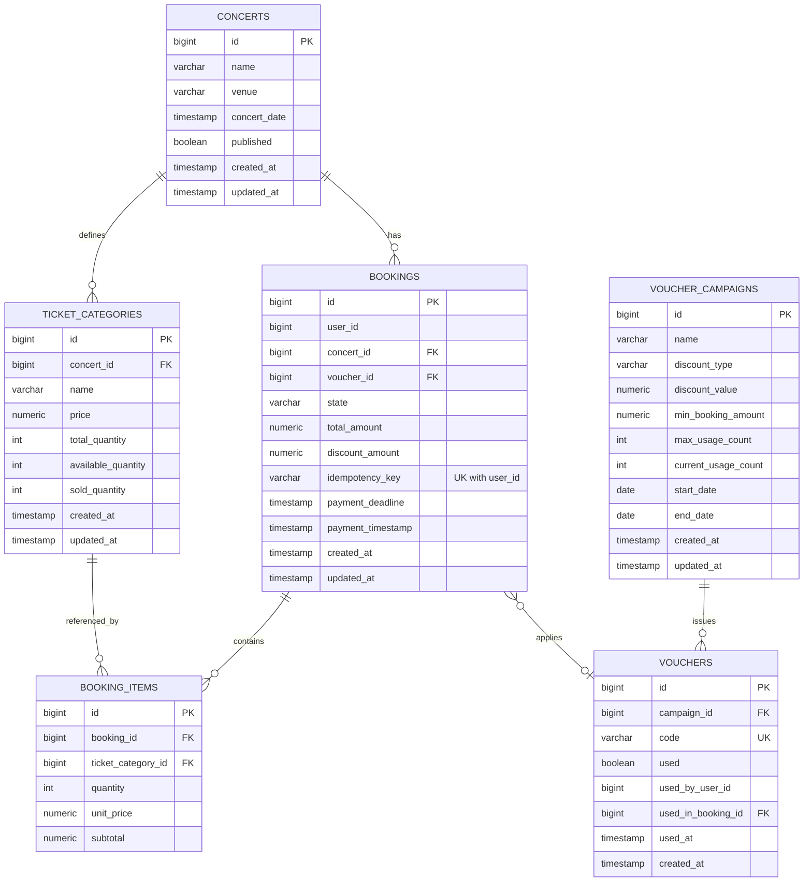

# Database Design Document: Concert Ticket Booking Platform

## 1. Overview & ERD Diagram

Hệ thống sử dụng **PostgreSQL 15** làm cơ sở dữ liệu quan hệ chính (Source of Truth). Tất cả dữ liệu liên quan đến Concert, Loại vé, Đơn đặt vé, Voucher và Lịch sử thanh toán đều được lưu trữ nhất quán tuân thủ các tính chất ACID.

### 1.1 Entity Relationship Diagram (ERD)



---

## 2. Table Specifications

### 2.1 Table: `concerts`
Lưu trữ thông tin các sự kiện âm nhạc / buổi biểu diễn.

| Column Name | Data Type | Nullable | Default | Description |
|---|---|---|---|---|
| `id` | BIGSERIAL | NO | Primary Key | Định danh duy nhất cho Concert |
| `name` | VARCHAR(255) | NO | - | Tên sự kiện âm nhạc |
| `venue` | VARCHAR(255) | NO | - | Địa điểm tổ chức |
| `concert_date` | TIMESTAMP | NO | - | Thời gian diễn ra sự kiện |
| `published` | BOOLEAN | NO | `false` | Trạng thái công khai (true = khách hàng có thể thấy và đặt vé) |
| `created_at` | TIMESTAMP | NO | `CURRENT_TIMESTAMP` | Thời gian tạo |
| `updated_at` | TIMESTAMP | NO | `CURRENT_TIMESTAMP` | Thời gian cập nhật gần nhất |

**Indexes:**
- `idx_concerts_published_date`: `(published, concert_date DESC)` (Tối ưu truy vấn danh sách Concert công khai)

---

### 2.2 Table: `ticket_categories`
Lưu trữ thông tin các hạng vé (VIP, Standard, SVIP...) của từng Concert.

| Column Name | Data Type | Nullable | Default | Description |
|---|---|---|---|---|
| `id` | BIGSERIAL | NO | Primary Key | Định danh duy nhất cho Hạng vé |
| `concert_id` | BIGINT | NO | FK (`concerts.id`) | Khóa ngoại tham chiếu đến Concert |
| `name` | VARCHAR(100) | NO | - | Tên hạng vé (ví dụ: VIP, Standard) |
| `price` | NUMERIC(15,2) | NO | - | Giá vé cơ bản (VND) |
| `total_quantity` | INT | NO | - | Tổng số lượng vé phát hành |
| `available_quantity` | INT | NO | - | Số lượng vé còn khả dụng (chưa giữ/mua) |
| `sold_quantity` | INT | NO | `0` | Số lượng vé đã thanh toán thành công |
| `created_at` | TIMESTAMP | NO | `CURRENT_TIMESTAMP` | Thời gian tạo |
| `updated_at` | TIMESTAMP | NO | `CURRENT_TIMESTAMP` | Thời gian cập nhật |

**Constraints:**
- `chk_available_quantity_non_negative`: `CHECK (available_quantity >= 0)`
- `chk_price_positive`: `CHECK (price > 0)`

**Indexes:**
- `idx_ticket_categories_concert`: `(concert_id)`

---

### 2.3 Table: `bookings`
Lưu trữ đơn đặt vé của khách hàng và trạng thái vòng đời đơn hàng.

| Column Name | Data Type | Nullable | Default | Description |
|---|---|---|---|---|
| `id` | BIGSERIAL | NO | Primary Key | Mã định danh đơn hàng |
| `user_id` | BIGINT | NO | - | ID khách hàng thực hiện đặt vé |
| `concert_id` | BIGINT | NO | FK (`concerts.id`) | Khóa ngoại tham chiếu Concert |
| `voucher_id` | BIGINT | YES | FK (`vouchers.id`) | Khóa ngoại Voucher được áp dụng (nếu có) |
| `state` | VARCHAR(30) | NO | `'PENDING'` | Trạng thái đơn vé (`PENDING`, `AWAITING_PAYMENT`, `CONFIRMED`, `CANCELLED`, `EXPIRED`) |
| `total_amount` | NUMERIC(15,2) | NO | - | Tổng tiền đơn hàng sau giảm giá |
| `discount_amount` | NUMERIC(15,2) | NO | `0.00` | Số tiền được giảm từ voucher |
| `idempotency_key` | VARCHAR(128) | NO | UNIQUE with `user_id` | Key chống duplicate booking do client gửi |
| `payment_deadline` | TIMESTAMP | NO | - | Hạn chót thanh toán (mặc định createdAt + 15 mins) |
| `payment_timestamp` | TIMESTAMP | YES | NULL | Thời điểm thanh toán thành công |
| `created_at` | TIMESTAMP | NO | `CURRENT_TIMESTAMP` | Thời gian tạo đơn |
| `updated_at` | TIMESTAMP | NO | `CURRENT_TIMESTAMP` | Thời gian cập nhật |

**Constraints:**
- `uq_bookings_user_idempotency_key`: `UNIQUE (user_id, idempotency_key)`
- `chk_booking_state`: `CHECK (state IN ('PENDING', 'AWAITING_PAYMENT', 'CONFIRMED', 'CANCELLED', 'EXPIRED'))`

**Indexes:**
- `idx_bookings_user_created`: `(user_id, created_at DESC)` (Cho API xem lịch sử đặt vé của user)
- `idx_bookings_expiry_state_deadline`: `(state, payment_deadline)` (Tối ưu cho Scheduler quét đơn `PENDING`/`AWAITING_PAYMENT` hết hạn)
- `idx_bookings_admin_filter`: `(state, concert_id, created_at)` (Tối ưu cho Admin Dashboard filter)

---

### 2.4 Table: `booking_items`
Chi tiết các hạng vé và số lượng vé nằm trong từng đơn hàng.

| Column Name | Data Type | Nullable | Default | Description |
|---|---|---|---|---|
| `id` | BIGSERIAL | NO | Primary Key | Định danh dòng sản phẩm đơn hàng |
| `booking_id` | BIGINT | NO | FK (`bookings.id`) | Khóa ngoại đơn hàng |
| `ticket_category_id` | BIGINT | NO | FK (`ticket_categories.id`) | Khóa ngoại hạng vé |
| `quantity` | INT | NO | - | Số lượng vé đặt (1 đến 10) |
| `unit_price` | NUMERIC(15,2) | NO | - | Đơn giá vé tại thời điểm đặt |
| `subtotal` | NUMERIC(15,2) | NO | - | Thành tiền (`quantity * unit_price`) |

**Constraints:**
- `chk_booking_item_quantity`: `CHECK (quantity >= 1 AND quantity <= 10)`

**Indexes:**
- `idx_booking_items_booking`: `(booking_id)`

---

### 2.5 Table: `voucher_campaigns`
Lưu trữ thông tin các đợt khuyến mãi/chiến dịch phát hành mã giảm giá.

| Column Name | Data Type | Nullable | Default | Description |
|---|---|---|---|---|
| `id` | BIGSERIAL | NO | Primary Key | Định danh chiến dịch |
| `name` | VARCHAR(255) | NO | - | Tên chiến dịch khuyến mãi |
| `discount_type` | VARCHAR(20) | NO | - | Loại giảm giá (`PERCENTAGE` hoặc `FIXED_AMOUNT`) |
| `discount_value` | NUMERIC(15,2) | NO | - | Giá trị giảm (% từ 1-100 hoặc số tiền giảm > 0) |
| `min_booking_amount` | NUMERIC(15,2) | NO | `0.00` | Giá trị đơn hàng tối thiểu để áp dụng |
| `max_usage_count` | INT | NO | - | Lượt sử dụng tối đa của toàn chiến dịch |
| `current_usage_count` | INT | NO | `0` | Số lượt đã sử dụng hiện tại |
| `start_date` | DATE | NO | - | Ngày bắt đầu chiến dịch |
| `end_date` | DATE | NO | - | Ngày kết thúc chiến dịch |
| `created_at` | TIMESTAMP | NO | `CURRENT_TIMESTAMP` | Thời gian tạo |
| `updated_at` | TIMESTAMP | NO | `CURRENT_TIMESTAMP` | Thời gian cập nhật |

**Constraints:**
- `chk_campaign_dates`: `CHECK (end_date >= start_date)`
- `chk_campaign_usage`: `CHECK (current_usage_count <= max_usage_count)`

---

### 2.6 Table: `vouchers`
Danh sách các mã voucher cụ thể phát hành thuộc chiến dịch.

| Column Name | Data Type | Nullable | Default | Description |
|---|---|---|---|---|
| `id` | BIGSERIAL | NO | Primary Key | Định danh mã voucher |
| `campaign_id` | BIGINT | NO | FK (`voucher_campaigns.id`) | Khóa ngoại chiến dịch |
| `code` | VARCHAR(16) | NO | UNIQUE | Mã voucher duy nhất (8-16 ký tự chữ/số) |
| `used` | BOOLEAN | NO | `false` | Trạng thái đã sử dụng |
| `used_by_user_id` | BIGINT | YES | NULL | ID user đã sử dụng |
| `used_in_booking_id` | BIGINT | YES | FK (`bookings.id`) | ID đơn hàng đã áp dụng |
| `used_at` | TIMESTAMP | YES | NULL | Thời điểm sử dụng |
| `created_at` | TIMESTAMP | NO | `CURRENT_TIMESTAMP` | Thời gian khởi tạo mã |

**Constraints:**
- `uq_vouchers_code`: `UNIQUE (code)`

**Indexes:**
- `idx_vouchers_code`: `(code)`

---

## 3. Inventory Operations SQL Logics

### 3.1 Atomic Reservation (Trừ kho trong đơn giữ vé Flash Sale)
Sử dụng câu lệnh CAS SQL để ngăn overselling ngay tại DB level:

```sql
UPDATE ticket_categories 
SET available_quantity = available_quantity - :requestedQuantity,
    updated_at = CURRENT_TIMESTAMP
WHERE id = :ticketCategoryId 
  AND available_quantity >= :requestedQuantity;
```
*Lưu ý:* Nếu số hàng bị ảnh hưởng (`rows_affected`) bằng 0, ứng dụng lập tức throw `TicketSoldOutException` và rollback transaction.

### 3.2 Restoration on Cancel / Expiry (Hoàn trả vé khi Hết hạn hoặc Hủy đơn)
Khi đơn hàng bị hủy hoặc quá thời hạn thanh toán (15 phút), kho vé sẽ được khôi phục nguyên trạng:

```sql
-- 1. Cộng trả số lượng vé khả dụng
UPDATE ticket_categories 
SET available_quantity = available_quantity + :quantity,
    updated_at = CURRENT_TIMESTAMP
WHERE id = :ticketCategoryId;

-- 2. Khôi phục lượt sử dụng Voucher (nếu đơn có dùng voucher)
UPDATE voucher_campaigns 
SET current_usage_count = current_usage_count - 1,
    updated_at = CURRENT_TIMESTAMP
WHERE id = :campaignId AND current_usage_count > 0;

UPDATE vouchers 
SET used = false, used_by_user_id = NULL, used_in_booking_id = NULL, used_at = NULL 
WHERE id = :voucherId;
```
