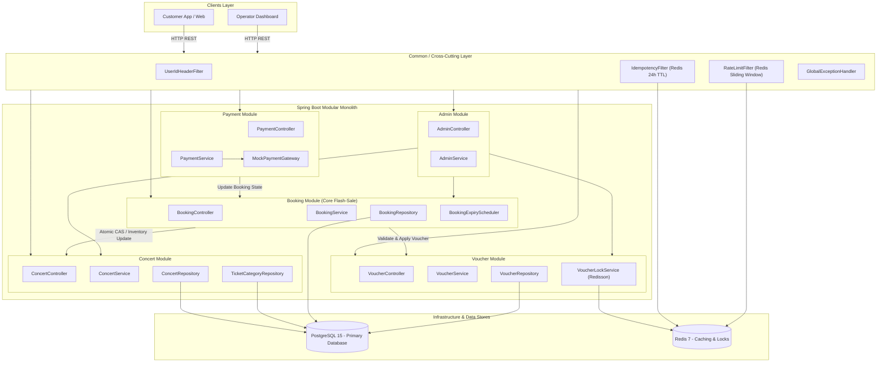
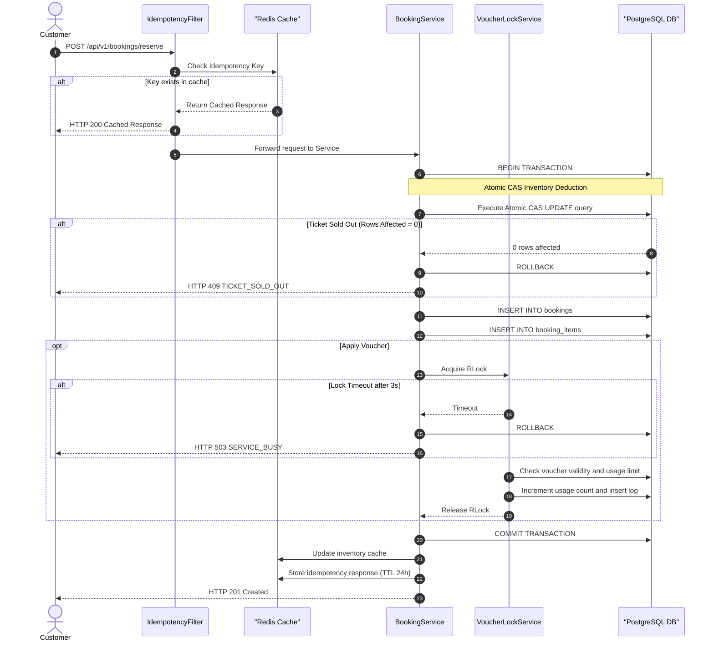
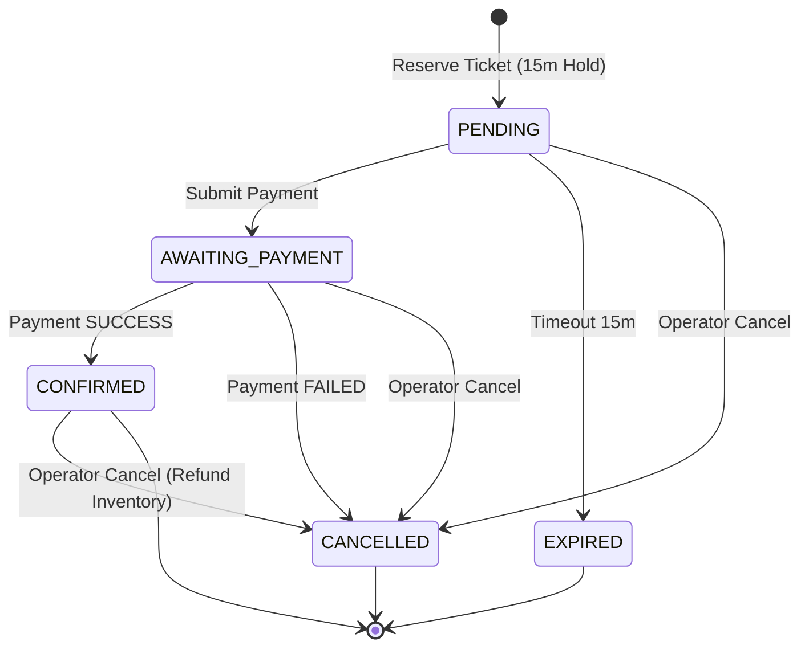

# System Design Document: Concert Ticket Booking Platform

## 1. Overview & Architecture

Nền tảng Đặt vé Sự kiện Âm nhạc (Concert Ticket Booking Platform) là một dịch vụ backend được thiết kế theo kiến trúc **Modular Monolith (Monolith phân mô-đun theo Domain Context / Package-by-Feature)** trên nền **Java 21** và **Spring Boot 3**. Hệ thống kết hợp sức mạnh của **PostgreSQL 15** (Source of Truth duy nhất cho dữ liệu quan hệ) và **Redis 7** (cho caching, idempotency deduplication và distributed locking qua Redisson).

### Tại sao chọn Kiến trúc Modular Monolith?
1. **High Cohesion & Low Coupling**: Mỗi mô-đun (Concert, Booking, Voucher, Payment, Admin) tự đóng gói toàn bộ Domain Model, Service, Repository và Controller của riêng mình. 
2. **Sẵn sàng cho Microservices (Microservices-Ready)**: Các mô-đun giao tiếp với nhau qua các Interface/DTO rõ ràng. Trong tương lai, nếu lưu lượng tăng vọt, từng mô-đun (ví dụ: `booking-module`) có thể tách ra thành Microservice độc lập mà không cần viết lại ứng dụng.
3. **Quản lý ranh giới nghiệp vụ (Clear Bounded Contexts)**: Giúp mã nguồn dễ bảo trì, dễ viết Unit/Integration test độc lập cho từng module.

---

### 1.1 Modular Package Structure

```
com.geekup.ticketbooking/
├── common/                  # Shared Infrastructure & Cross-Cutting Concerns
│   ├── config/              # Redis, Redisson, Async, Web MVC Configs
│   ├── dto/                 # ApiResponse<T>, ErrorResponse, PageResult<T>
│   ├── exception/           # ApplicationException & GlobalExceptionHandler
│   ├── filter/              # IdempotencyFilter, RateLimitFilter, UserIdHeaderFilter
│   └── lock/                # DistributedLockAspect / Redisson Utilities
└── module/
    ├── concert/             # Concert Catalog Domain Module (Quản lý sự kiện & Hạng vé)
    │   ├── controller/      # ConcertController
    │   ├── entity/          # Concert, TicketCategory
    │   ├── repository/      # ConcertRepository, TicketCategoryRepository
    │   └── service/         # ConcertService, InventoryCacheService
    ├── booking/             # Booking & Reservation Domain Module (Giữ vé & State Machine)
    │   ├── controller/      # BookingController
    │   ├── entity/          # Booking, BookingItem, BookingState (Enum)
    │   ├── repository/      # BookingRepository, BookingItemRepository
    │   ├── scheduler/       # BookingExpiryScheduler (Background Job quét vé hết hạn)
    │   └── service/         # BookingService, IdempotencyService
    ├── voucher/             # Voucher & Campaign Domain Module (Mã giảm giá & Khóa phân tán)
    │   ├── controller/      # VoucherController
    │   ├── entity/          # VoucherCampaign, Voucher
    │   ├── repository/      # VoucherCampaignRepository, VoucherRepository
    │   └── service/         # VoucherService, VoucherLockService
    ├── payment/             # Payment Domain Module (Thanh toán & Mock Payment Gateway)
    │   ├── controller/      # PaymentController
    │   ├── gateway/         # MockPaymentGateway (Giả lập cổng thanh toán)
    │   └── service/         # PaymentService
    └── admin/               # Operator Admin Domain Module (Quản trị & Báo cáo)
        ├── controller/      # AdminController
        └── service/         # AdminService
```

---

### 1.2 System Architecture Diagram (Modular Monolith)



---

## 2. API Response & Error Handling Standards

Tất cả các API endpoints thuộc các mô-đun đều trả về cấu trúc response thống nhất thông qua lớp bao đệm `ApiResponse<T>` trong gói `common.dto`.

### 2.1 Standard Success Envelope
```json
{
  "success": true,
  "data": {
    "bookingId": 42,
    "state": "PENDING",
    "totalAmount": 1500000.00,
    "paymentDeadline": "2026-08-14T17:30:00Z"
  },
  "timestamp": "2026-08-14T17:15:00Z"
}
```

### 2.2 Standard Error Envelope
```json
{
  "success": false,
  "error": {
    "code": "TICKET_SOLD_OUT",
    "message": "Loại vé yêu cầu đã hết số lượng khả dụng."
  },
  "timestamp": "2026-08-14T17:15:00Z"
}
```

### 2.3 Validation Error Envelope (HTTP 400)
```json
{
  "success": false,
  "error": {
    "code": "VALIDATION_ERROR",
    "message": "Dữ liệu yêu cầu không hợp lệ.",
    "fields": [
      {
        "field": "quantity",
        "reason": "Số lượng vé mỗi loại phải từ 1 đến 10"
      }
    ]
  },
  "timestamp": "2026-08-14T17:15:00Z"
}
```

---

## 3. Flash Sale Concurrency Control Mechanics

### 3.1 Flow Diagram: Reservation Request Processing



### 3.2 Key Concurrency Strategies

| Thách thức (Challenge) | Giải pháp kỹ thuật (Technical Solution) | Cơ chế hoạt động (Mechanism) |
|---|---|---|
| **Overselling** (Bán quá số vé) | **Atomic Row CAS Update** tại DB level | Sử dụng truy vấn SQL: `UPDATE ticket_categories SET available_quantity = available_quantity - :qty WHERE id = :id AND available_quantity >= :qty`. Database row lock tự động serialize các request đồng thời mà không cần distributed lock trên từng ticket category. |
| **Read Latency** (Đọc kho nhanh) | **Redis Inventory Read Cache** | Khi xem thông tin Concert, số lượng vé còn lại được đọc từ Redis key `inventory:{ticketCategoryId}` để giảm tải truy vấn `COUNT`/`SELECT` vào DB. Kho Redis được cập nhật sau khi DB commit transaction thành công. |
| **Duplicate Booking** (Đặt trùng) | **Idempotency Filter + Redis Cache** | Bắt buộc truyền header `Idempotency-Key` (max 128 chars). Filter kiểm tra key trong Redis. Nếu key đã có kết quả HTTP 2xx, lập tức trả về cached response mà không gọi xuống DB. Key có TTL 24 giờ. |
| **Voucher Abuse** (Lạm dụng mã) | **Redisson Lock per User+Voucher** | Tạo khóa phân tán Redisson với pattern `lock:voucher:{userId}:{voucherId}`. Đảm bảo 1 user không thể gửi 100 request đồng thời để dùng cùng 1 voucher vượt quá lượt phép. |
| **DDS Attack / Spam** (Quá tải) | **Redis Sliding Window Rate Limiter** | Giới hạn 200 requests/phút per `X-User-Id`. Khi vượt ngưỡng trả về HTTP 429 kèm header `Retry-After: 60`. |

---

## 4. Booking State Machine

Mỗi `Booking` trong mô-đun `booking` tuân theo một State Machine nghiêm ngặt để đảm bảo trạng thái vé và tồn kho luôn đồng bộ.



### 4.1 Valid Transitions & Side Effects Table

| Trạng thái hiện tại | Trạng thái chuyển đến | Tác nhân / Sự kiện | Tác dụng phụ (Side Effects) |
|---|---|---|---|
| `PENDING` | `AWAITING_PAYMENT` | Khách hàng thực hiện thanh toán | Khởi tạo giao dịch với Payment Gateway |
| `AWAITING_PAYMENT` | `CONFIRMED` | Payment Gateway trả lời SUCCESS | Ghi nhận `payment_timestamp`, chốt đơn hàng |
| `AWAITING_PAYMENT` | `CANCELLED` | Payment Gateway trả lời FAILED | **Cộng hoàn trả kho DB** (`available_quantity + qty`), Cập nhật Redis cache, Giảm lượt dùng Voucher |
| `PENDING` | `EXPIRED` | `BookingExpiryScheduler` quét (quá 15m) | **Cộng hoàn trả kho DB**, Cập nhật Redis cache, Giảm lượt dùng Voucher |
| `PENDING` | `CANCELLED` | Operator hủy thủ công | **Cộng hoàn trả kho DB**, Cập nhật Redis cache, Giảm lượt dùng Voucher |
| `AWAITING_PAYMENT` | `CANCELLED` | Operator hủy thủ công | **Cộng hoàn trả kho DB**, Cập nhật Redis cache, Giảm lượt dùng Voucher |
| `CONFIRMED` | `CANCELLED` | Operator hủy thủ công | **Cộng hoàn trả kho DB**, Cập nhật Redis cache, Giảm lượt dùng Voucher |

---

## 5. Exception & HTTP Error Code Mapping

Tất cả ngoại lệ trong hệ thống kế thừa từ `ApplicationException` và được xử lý tập trung qua `@ControllerAdvice` (`GlobalExceptionHandler`) thuộc gói `common`.

| Exception Class | HTTP Status | Error Code | Mô tả |
|---|---|---|---|
| `TicketSoldOutException` | 409 Conflict | `TICKET_SOLD_OUT` | Loại vé đã hết kho khả dụng |
| `IdempotencyKeyMissingException` | 400 Bad Request | `MISSING_IDEMPOTENCY_KEY` | Thiếu header `Idempotency-Key` ở API reserve |
| `InvalidQuantityException` | 422 Unprocessable Entity | `INVALID_QUANTITY` | Số lượng vé mua < 1 hoặc > 10 |
| `VoucherNotFoundException` | 404 Not Found | `VOUCHER_NOT_FOUND` | Mã voucher không tồn tại |
| `VoucherAlreadyUsedException` | 409 Conflict | `VOUCHER_ALREADY_USED` | User đã sử dụng voucher này trước đó |
| `VoucherExhaustedException` | 409 Conflict | `VOUCHER_EXHAUSTED` | Voucher đã hết tổng lượt sử dụng toàn hệ thống |
| `VoucherCampaignInactiveException` | 422 Unprocessable Entity | `VOUCHER_CAMPAIGN_INACTIVE` | Chiến dịch voucher chưa bắt đầu hoặc đã hết hạn |
| `VoucherMinimumNotMetException` | 422 Unprocessable Entity | `VOUCHER_MINIMUM_NOT_MET` | Đơn hàng chưa đạt giá trị tối thiểu để dùng voucher |
| `InvalidBookingStateException` | 409 Conflict | `INVALID_BOOKING_STATE` | Đơn hàng không ở trạng thái PENDING khi thanh toán |
| `InvalidStateTransitionException` | 422 Unprocessable Entity | `INVALID_STATE_TRANSITION` | Chuyển trạng thái đơn hàng không hợp lệ |
| `BookingNotFoundException` | 404 Not Found | `BOOKING_NOT_FOUND` | Không tìm thấy đơn hàng với ID tương ứng |
| `ConcertNotFoundException` | 404 Not Found | `CONCERT_NOT_FOUND` | Không tìm thấy sự kiện âm nhạc |
| `ServiceBusyException` | 503 Service Unavailable | `SERVICE_BUSY` | Không lấy được Distributed Lock (kèm `Retry-After: 2`) |
| `PaymentGatewayTimeoutException` | 504 Gateway Timeout | `PAYMENT_GATEWAY_TIMEOUT` | Payment gateway không phản hồi trong 10 giây |
| `PaymentFailedException` | 402 Payment Required | `PAYMENT_FAILED` | Giao dịch thanh toán không thành công |
| `ForbiddenException` | 403 Forbidden | `FORBIDDEN` | Không có quyền truy cập đơn hàng của user khác |
| `MethodArgumentNotValidException` | 400 Bad Request | `VALIDATION_ERROR` | Lỗi validation trường dữ liệu đầu vào |
| `Unhandled Exception` | 500 Internal Server Error | `INTERNAL_SERVER_ERROR` | Lỗi hệ thống không xác định (không lộ stacktrace) |
