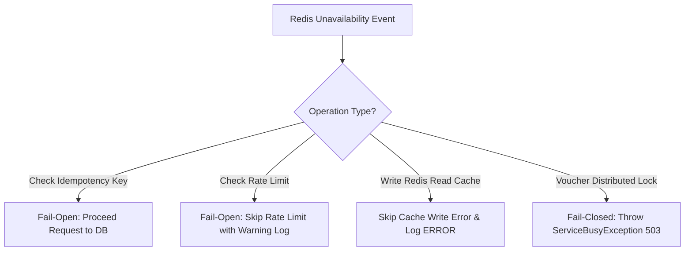

# Architectural Trade-offs & Engineering Decisions

Tài liệu này tổng hợp các quyết định kiến trúc và phân tích sự đánh đổi (Trade-offs) trong quá trình thiết kế Nền tảng Đặt vé Sự kiện Âm nhạc (Concert Ticket Booking Platform).

---

## 1. Database Row CAS Atomic Update vs Redis Distributed Lock for Inventory

### 1.1 Bối cảnh vấn đề
Trong bài toán Flash Sale với 50,000 người dùng đồng thời tranh mua số lượng vé giới hạn (ví dụ: 100 vé VIP), nguy cơ bán vượt quá số lượng khả dụng (**Overselling**) là thách thức cốt lõi.

### 1.2 Các phương pháp cân nhắc

#### Option A: Giữ khóa phân tán Redis (Redis Distributed Lock per TicketCategory)
- **Cách hoạt động**: Khi có request đặt vé, ứng dụng dùng Redisson xin lock key `lock:ticket:{ticketCategoryId}` -> Kiểm tra số lượng -> Trừ kho trong Redis/DB -> Release Lock.
- **Ưu điểm**: Đơn giản về mặt ý tưởng.
- **Nhược điểm**: 
  - **Nghẽn cổ chai nghiêm trọng (Lock Contention)**: Tất cả request mua vé thuộc cùng hạng vé phải xếp hàng tuần tự qua 1 lock duy nhất. Thời gian xử lý bị đẩy lên cao, dễ gây Timeout 503 cho người dùng dù kho vẫn còn vé.
  - **Phụ thuộc mạnh vào Redis**: Nếu Redis chập chờn, luồng ghi bị gián đoạn hoàn toàn.

#### Option B (Được lựa chọn): Atomic CAS Update trực tiếp tại Database (PostgreSQL Row-level Lock)
- **Cách hoạt động**:
  ```sql
  UPDATE ticket_categories 
  SET available_quantity = available_quantity - :qty 
  WHERE id = :id AND available_quantity >= :qty;
  ```
- **Tại sao chọn Option B?**:
  - **ACID Compliant**: PostgreSQL tự động quản lý row-level lock tại dòng của `ticket_category` đó. Trạng thái kho được bảo vệ tuyệt đối bởi Database Engine mà không sợ race-condition.
  - **Tối ưu Concurrency**: Engine DB đã được tối ưu cực tốt cho các thao tác ghi nguyên tử (Atomic CAS). Không xảy ra hiện tượng phantom read hay dính race condition giữa nhiều ứng dụng (multi-instance).
  - **Redis đóng vai trò Read-Cache**: Redis không phải là Source-of-Truth cho thao tác ghi, mà chỉ là Read-Cache phục vụ khách hàng duyệt vé nhanh (Response time < 5ms). Khi DB update thành công, Cache được làm mới bất đồng bộ.

---

## 2. Redisson Lock Scope for Vouchers: Scoped (`userId + voucherId`) vs Global Lock

### 2.1 Bối cảnh vấn đề
Một người dùng xấu có thể cố tình gửi 100 request đồng thời với cùng 1 mã Voucher nhằm trục lợi giảm giá nhiều lần trước khi hệ thống kịp ghi nhận lượt dùng.

### 2.2 Đánh đổi thiết kế

| Tiêu chí | Global Lock (`lock:voucher:{voucherId}`) | Fine-Grained Scoped Lock (`lock:voucher:{userId}:{voucherId}`) - **ĐƯỢC CHỌN** |
|---|---|---|
| **Phạm vi khóa** | Khóa toàn bộ voucher với mọi người dùng | Chỉ khóa cặp `userId` và `voucherId` cụ thể |
| **Hiệu năng (Throughput)** | Thấp: Người dùng A mua phải chờ người dùng B dùng xong voucher | **Rất cao**: Người dùng A và B dùng cùng 1 voucher hoàn toàn song song không ảnh hưởng nhau |
| **Mục tiêu bảo vệ** | Bảo vệ tổng số lượt voucher | **Chống gian lận 1 user dùng n lần đồng thời**, tổng số lượt dùng toàn hệ thống vẫn được chốt nguyên tử tại DB (`current_usage_count < max_usage_count`) |
| **Phức tạp** | Thấp | Trung bình (Cần format key động trên Redis) |

---

## 3. Booking Expiry: Scheduled Spring `@Scheduled` vs Distributed Queue / Redis Keyspace Expiry

### 3.1 Bối cảnh vấn đề
Đơn hàng ở trạng thái `PENDING` có hạn thanh toán 15 phút. Nếu người dùng không thanh toán, hệ thống phải tự động trả vé lại về kho.

### 3.2 So sánh giải pháp

1. **Redis Keyspace Expiry Notifications / RabbitMQ TTL**:
   - *Ưu điểm*: Trả vé chính xác từng giây sau khi hết hạn 15 phút.
   - *Nhược điểm*: Pub/Sub Redis không đảm bảo nhận đủ message 100% nếu mạng gián đoạn (At-most-once delivery). Tăng chi phí vận hành Message Broker.
2. **Spring `@Scheduled` Batch Job (Được lựa chọn)**:
   - *Cách hoạt động*: Mỗi 30 giây, một background job chạy câu truy vấn SQL tìm các đơn `PENDING` có `payment_deadline < NOW()`, chuyển trạng thái thành `EXPIRED` và hoàn trả kho DB + Redis cache trong 1 Transaction.
   - *Lý do chọn*: Đơn giản, tin cậy, nhất quán 100% dữ liệu (At-least-once processing qua DB query), giảm độ phức tạp hạ tầng cho bài test.

---

## 4. Redis Resiliency: Fail-Open vs Fail-Closed Strategy

Khi Redis gặp sự cố (Network Partition, Node Crash), hệ thống áp dụng chiến lược phân tách:



- **Fail-Open (Idempotency & Rate Limit)**: Đảm bảo khách hàng không bị chặn mua vé hợp lệ chỉ vì Redis caching layer gặp sự cố tạm thời. PostgreSQL vẫn có unique constraint `idempotency_key` làm lá chắn cuối cùng.
- **PostgreSQL làm Single Source of Truth**: Mọi giao dịch tiền bạc và số lượng vé đều được ghi chép và xác thực trước tiên tại PostgreSQL.
